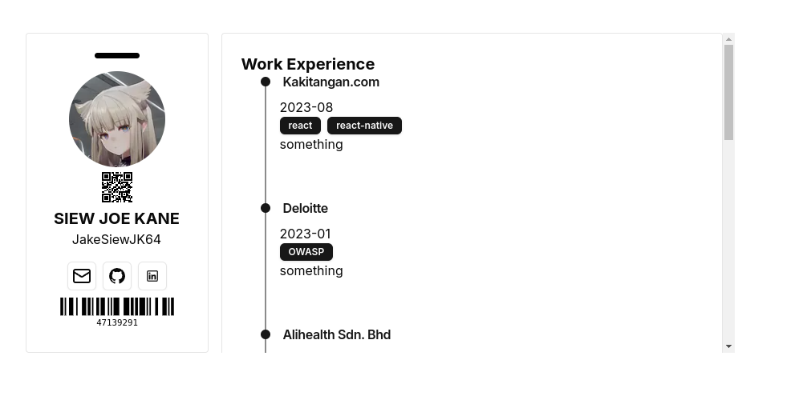

### Portfolio Website

this portfolio website is dynamic that it reads data stored in your JSON file. This JSON file can be from your github repo or elsewhere as long as it is publically available.

### Screenshots

### Data Source
You need to specify an endpoint to your data source to be rendered on the portfolio site. The environment variable for this is `JSON_DATA_ENDPOINT` which you can specify in a `.env` file or in Vercel.
