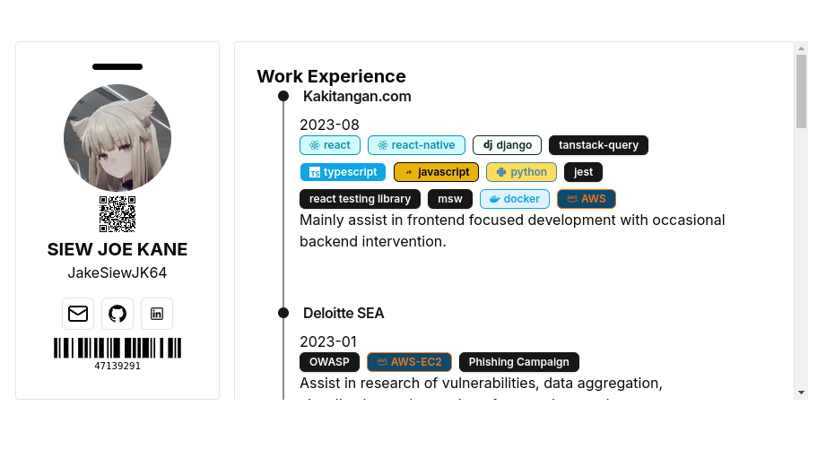

### Portfolio Website

this portfolio website is dynamic that it reads data stored in your JSON file. This JSON file can be from your github repo or elsewhere as long as it is publically available.

### Screenshots

